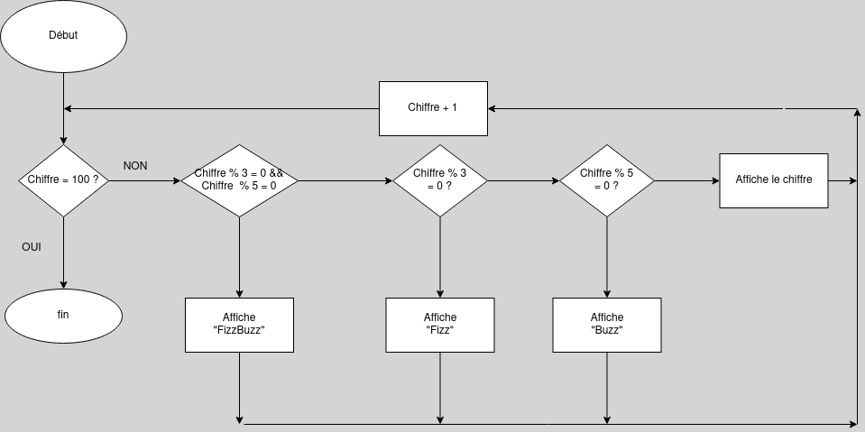

# FizzBuzz

Write a program that uses console.log to print all the numbers from 1 to 100, with two exceptions. For numbers divisible by 3, print "Fizz" instead of the number, and for numbers divisible by 5 (and not 3), print "Buzz" instead.

When you have that working, modify your program to print "FizzBuzz" for numbers that are divisible by both 3 and 5 (and still print "Fizz" or "Buzz" for numbers divisible by only one of those).

# Algorigramme


# Pseudocode
```
Procédure FizzBuzz
variable : number i
i <- 0
Pour i de 1 à 100; i + 1 faire :
    si i % 3 = 0 et i % 5 = 0
        alors: FizzBuzz
    sinon si i % 3 = 0
        alors: Fizz
    sinon si i % 5 = 0 
        alors: Buzz
    sinon affiche i
    fin si
fin Pour
```

# Solution
```JS
for (let i = 0; i <= 100; i + 1) {
  if (i % 3 === 0 && i % 5 === 0) {
    console.log('fizzbuzz');
  } else if (i % 3 === 0) {
    console.log('fizz');
  } else if (i % 5 === 0) {
    console.log('buzz');
  } else {
    console.log(i);
  }
}
```