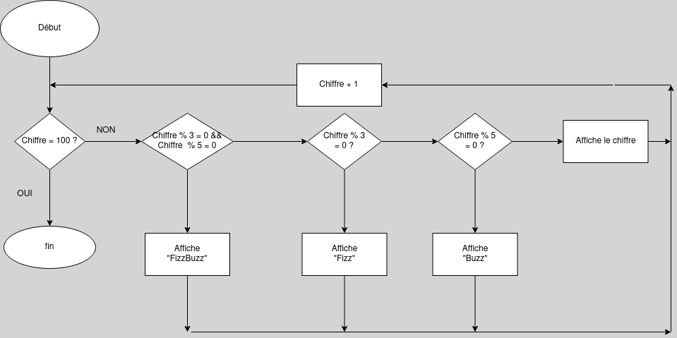

# Chessboard


Write a program that creates a string that represents an 8×8 grid, using newline characters to separate lines. At each position of the grid there is either a space or a "#" character. The characters should form a chessboard.

Passing this string to console.log should show something like this:

```
 # # # #
# # # #
 # # # #
# # # #
 # # # #
# # # #
 # # # #
# # # #
```

When you have a program that generates this pattern, define a binding size = 8 and change the program so that it works for any size, outputting a grid of the given width and height.

# Algorithme


# Pseudocode
```
Procedure printChessboard
Pour i entre 0 et 6; i++ faire:
variable : chaine de caractère row
row <- ' '
    si i est paire
        pour j entre 0 et 7; j++ faire:
            si j est paire 
                alors row += ''
            sinon 
                alors row += '#'
            fin j 
        fin pour
    sinon 
        pour j entre 0 et 7; j++ faire:
            si j est paire
                alors row += '#'
            sinon 
                alors row += ''
            fin si 
        fin pour
    fin i 
    affiche row
fin pour
```