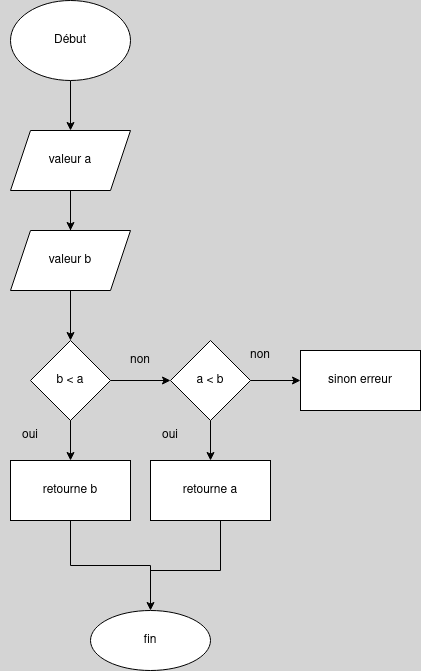

# Minimum

Write a function min that takes two arguments and returns their minimum.

# Algorigramme


# Pseudocode
```
fonction returnMinimun (a, b)
variable : number1 
number1 <- a 
variable : number2 
number2 <- b
    si number1 < number2 alors :
        affiche number1 est minimun
    sinon si number2 < number1 alors :
        affiche number2 est minimun
    sinon 
        affiche number2 = number1
    finSi
renvoyer returnMinimun
```

# Solution
```JS
const prompt = require('prompt-sync')();

const input1 = prompt('Prompt value1: ');
const input2 = prompt('Prompt value2: ');

function returnMinimum(value1, value2) {
  if (value1 < value2) {
    console.log(`${value1} is the lowest value`);
  } else if (value2 < value1) {
    console.log(`${value2} is the lowest value`);
  } else console.log('error: You\'re values are equal');
}

returnMinimum(input1, input2);
```